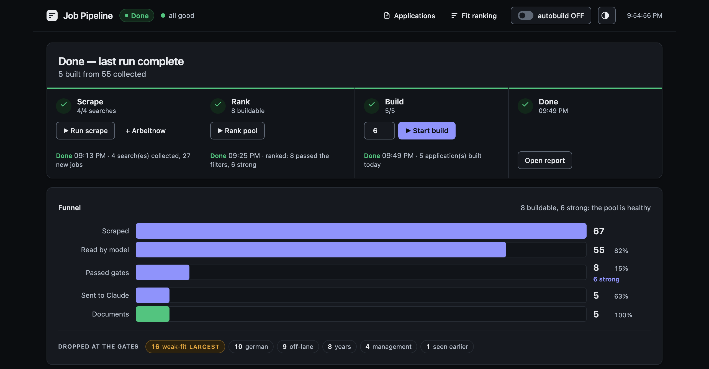
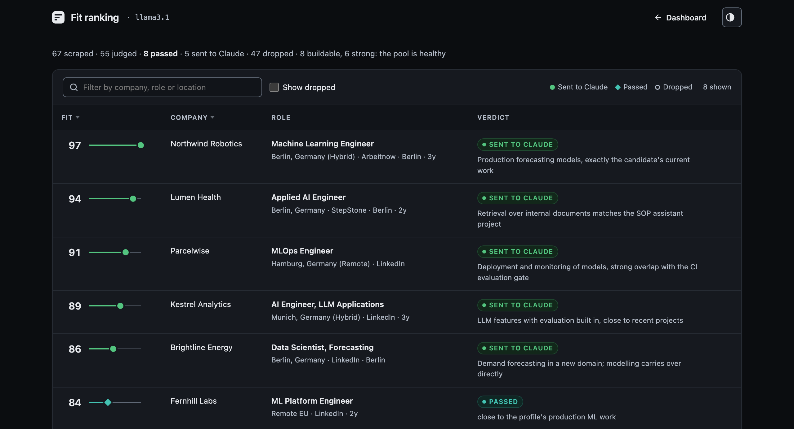
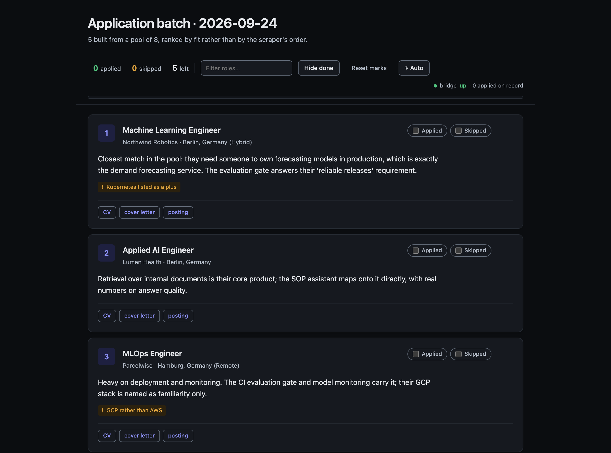
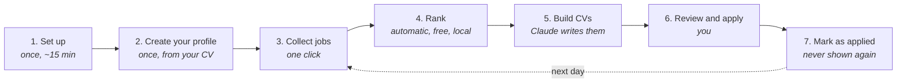

# Job Pipeline

**Finds jobs that fit you and writes a tailored CV and cover letter for each
one, on your own computer.**

You collect postings with one click. A free AI on your laptop reads every one
and keeps only the jobs that match you. Claude then writes a CV and a cover
letter for each match, and you review and send them.



<table>
  <tr>
    <td width="50%"></td>
    <td width="50%"></td>
  </tr>
  <tr>
    <td align="center"><b>Fit ranking</b>: every job scored, with the reason</td>
    <td align="center"><b>Applications</b>: CV, cover letter and posting for each</td>
  </tr>
</table>

<sub>Screenshots show a made-up person and made-up companies.</sub>

---

## How it works



| Step | You do | It does |
|---|---|---|
| **Collect** | press **+ Arbeitnow**, or run your saved LinkedIn searches from the Chrome extension | gathers postings with their full descriptions |
| **Rank** | press **Rank pool** | a local AI reads every posting and drops the ones that don't fit: wrong language, too senior, wrong field |
| **Build** | choose how many, press **Build** | Claude writes a one-page CV and a cover letter for each of the best matches |
| **Apply** | open **Applications**, download, send | |
| **Mark applied** | press **Mark this job applied** in the extension | that job never comes back |

---

## What you need

- **A Mac or Linux computer** with **[Python 3.11+](https://www.python.org/downloads/)**
- **[Ollama](https://ollama.com/download)**: the free local AI that ranks jobs. Install it and open it once.
- **[Claude Code](https://claude.com/claude-code)** and a Claude subscription: writes the CVs.
- **Google Chrome** (optional): only for collecting from LinkedIn, Indeed or StepStone.

---

## Set up (once)

**1. Get the code.** Download the ZIP from this page (green **Code** button →
**Download ZIP**) and unzip it, or `git clone` it.

**2. Open Terminal in that folder.** On a Mac: open the folder in Finder,
right-click it, choose **New Terminal at Folder**.

**3. Run the setup:**

```bash
./setup.sh
```

It installs everything it needs and tells you if anything is missing. Safe to
run again.

**4. Sign in to Claude** (once):

```bash
claude auth login
```

**5. Create your profile from your current CV:**

```bash
claude "/make-profile ~/Downloads/my-cv.pdf"
```

Use the real path to your CV (PDF, Word or text). Claude reads it and fills in
`profiles/me/`. **Open `profiles/me/profile.md` once and check it**: it decides
which jobs rank highly.

**6. Start it:**

```bash
./start.sh
```

Your browser opens the dashboard. Keep the Terminal window open while you use
it; press `Ctrl+C` there to stop. On a Mac, `scripts/install-agent.sh` makes it
start by itself at every login instead. The **Setup** panel at the top lists anything
still missing, with the command to fix it. When it disappears, you're ready.

**7. (Optional) Install the Chrome extension**, to collect from LinkedIn:

1. Open `chrome://extensions` in Chrome
2. Turn on **Developer mode** (top right)
3. Click **Load unpacked** and choose the `extension` folder inside this project
4. Click the puzzle icon in the toolbar and pin **Job Collector**

---

## Everyday use

1. Run `./start.sh`. The dashboard opens.
2. **Collect.** Press **+ Arbeitnow**, or in the Chrome extension open
   **Saved searches** and press **Run all searches now**.
3. **Rank.** Press **Rank pool**. It takes a few minutes; the **Funnel** shows
   how many jobs survived each filter.
4. **Build.** Pick how many applications you want (5 is a good start) and press
   **Build**. Each one uses some of your Claude usage.
5. **Apply.** Click **Applications** at the top: each job has its CV, its cover
   letter and a link to the posting.
6. **Mark it.** After applying, open the job's page, click the extension, and
   press **Mark this job applied**.

The extension's **Dashboard**, **Applications** and **Fit ranking** buttons open
these pages from anywhere.

---

## Where your files are

| What | Where |
|---|---|
| Your profile | `profiles/me/`, never uploaded anywhere |
| Your CVs and cover letters | `builder/applications/<date>/<Company>/` |
| After **Erase everything** | moved to `builder/applications/archive/`, never deleted |
| Jobs you applied to | `scraper/history/applied.csv` (date, company, title, link), kept forever |
| Jobs collected in the last 30 days | `scraper/history/seen.csv` (title and company only). A job that comes back on a later day is skipped |

**Erase everything and start fresh** (in the extension, under **More**) clears
the collected jobs so the next collection starts from zero, and moves every
built CV and letter into the archive. It never touches your applied list or the
30-day job history, so jobs you applied to, and jobs already collected on an
earlier day, still never come back.

---

## If something goes wrong

**Look at the dashboard first.** The Setup panel checks everything, and every
step that fails shows why, the fix, and a **Retry** button. Retrying is always
safe: finished work is kept and skipped. The **Activity** panel lists everything
that happened.

| Problem | Fix |
|---|---|
| The dashboard won't open | Run `./start.sh`, and keep its window open |
| "Ollama is not running" | Open the Ollama app, or run `ollama serve` |
| "Your profile is filled in" is red | Step 5 above: create your profile |
| Build stops straight away | Read the message in the build log; usually the profile or the Claude login |
| The extension shows old things | You have two copies loaded. Remove the old one at `chrome://extensions` |

---

## Learn more

[**docs/GUIDE.md**](docs/GUIDE.md) covers everything in depth: every extension
feature, the job sources, how ranking decides, the settings you can change,
how Claude writes the documents, the CV-writing rules, and privacy.

## A note on LinkedIn

LinkedIn's terms don't allow automated collection. The extension reads only
pages you open yourself, at human pace, from your own logged-in browser. Still,
know it before you use it. The Arbeitnow source is a public API and raises none
of this.

## License

MIT, see [LICENSE](LICENSE).
