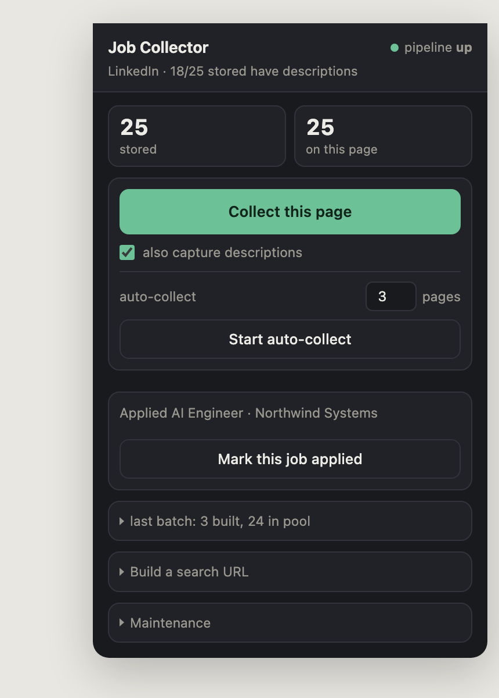
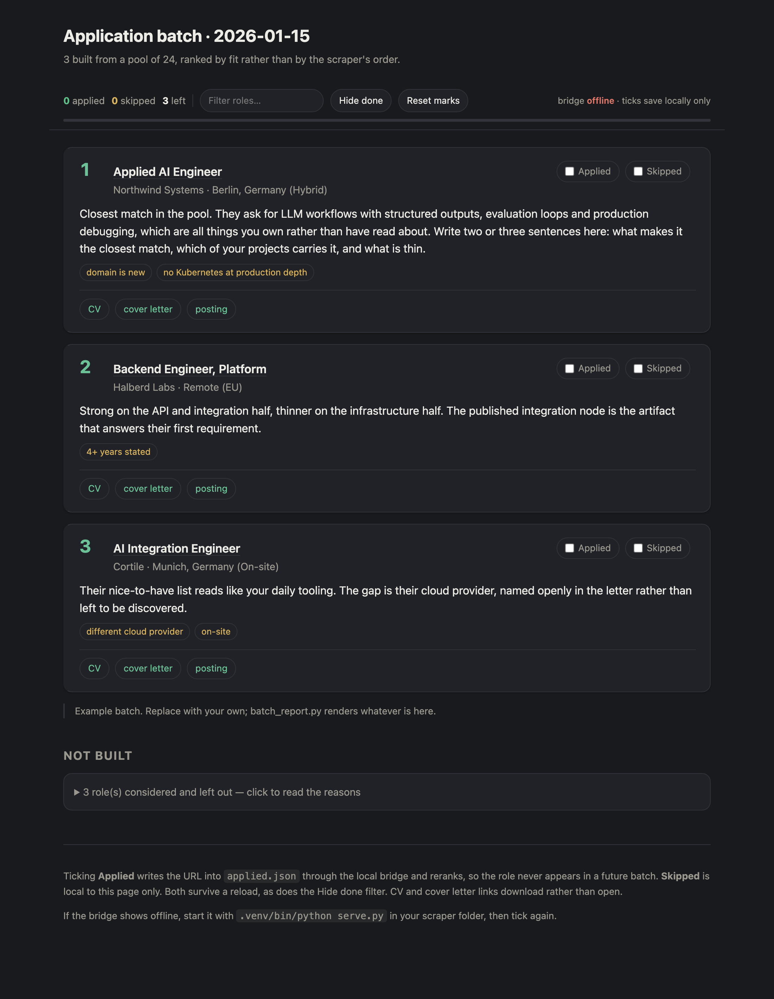

# Job application pipeline

Collect job postings from the page you are already looking at, rank them by fit
with an AI assistant that knows your background, generate tailored CVs and cover
letters as PDFs, and track what you applied to so the next batch excludes it.

Three pieces, usable separately:

| | |
|---|---|
| `extension/` | Chrome extension that collects postings from LinkedIn, Indeed and StepStone using your own logged-in session |
| `pipeline/` | PDF builder, portfolio spread checker, and the batch report generator |
| `claude/` | A slash command and a skill template for [Claude Code](https://claude.com/claude-code) |

<p align="center">
  
  &nbsp;&nbsp;
  
</p>

---

## Why an extension rather than a scraper

Job boards block scripted HTTP clients hard, and the good ones use bot
management that a headless browser does not get past for long. The extension
sidesteps the problem by not being a scraper: it runs inside the tab you already
have open, reading the DOM of a page you are already allowed to see, using your
own session. There is no automation driver and no separate login.

That has a limit worth stating plainly. **You are responsible for how you use
it.** Fetching detail pages in a loop is still traffic that a site can rate
limit or block, which is why description fetching is throttled with jitter and
why the collector deduplicates by URL before fetching anything. Do not raise
those limits because it feels slow.

The extension is a **dumb collector on purpose**. It captures title, company,
location, URL and description, and nothing else. Every judgement, relevance
scoring, language filtering, years extraction, ranking, lives on the other side,
so there is exactly one implementation of each rule and you can change your mind
without touching a content script.

---

## Setup

### 1. The extension

1. `chrome://extensions`, enable **Developer mode**
2. **Load unpacked**, select `extension/`
3. Open a search results page on LinkedIn, Indeed or StepStone
4. Click the extension icon and press **Collect this page**

**Auto-collect** walks several pages, clicking through pagination and waiting
between jobs. It survives navigation by keeping its state in `chrome.storage`,
and it stops if you take over the scroll, because a page that fights your scroll
wheel is worse than a slow one.

Collected jobs are held in `chrome.storage` and pushed to a local endpoint if
one is listening (see *The bridge*). Export JSON is the manual fallback.

Site adapters live at the top of `extension/content.js`. Each is a `test`, a
`cards` selector list, a `parse` function and a `next` pagination selector.
Adding a fourth job board is one object. **Selectors are deliberately
overlapping**, because boards rename classes without warning and a spare
selector is what keeps the collector working, but note `collectCards()`
deduplicates by URL for exactly that reason: on some layouts two selectors match
the same posting, once as the list item and once as a div nested inside it.

### 2. The pipeline

```bash
python3 -m venv .venv
.venv/bin/pip install -r pipeline/requirements.txt
```

Use the venv rather than bare `python3`. On macOS the Homebrew Python is
externally managed and will not have `reportlab`.

Build a document from a JSON payload:

```bash
.venv/bin/python pipeline/build_docs.py cv     examples/cv.example.json     out/CV.pdf
.venv/bin/python pipeline/build_docs.py letter examples/letter.example.json out/Letter.pdf
```

`build_docs.py` produces black-text A4, refuses em dashes, en dashes and double
hyphens outright, and inflates the file past a size floor, because some resume
parsers reject very small PDFs. It also linearises the result and keeps the
cross-reference table findable, which matters more than it sounds: a PDF that
opens perfectly in a viewer can still fail in a parser that reads `startxref`
strictly, and a lot of applicant tracking systems run one of those.

Check a CV payload before building it:

```bash
.venv/bin/python pipeline/check_spread.py applications/*/*/cv_*.json
```

This is the piece worth stealing even if you use nothing else. A model asked to
tailor a CV will reach for whichever project it has the most material on, and
then keep reaching, so you end up with five of seven bullets about one system,
several of them things that went wrong with it. It reads as one project that
kept breaking. `check_spread.py` fails the build if any single project supplies
more than two bullets, if fewer than three distinct projects appear, or if a
bullet hides behind a topic label like *Reliability work* instead of naming a
real project. It exits non-zero so a bad payload never reaches the PDF builder.

Do not edit the checker to make a payload pass.

Render a batch report:

```bash
.venv/bin/python pipeline/batch_report.py 2026-01-15
```

Reads `applications/<date>/batch.json`, writes `batch.html` beside it. See
`examples/batch.json` for the shape.

### 3. The batch report

The report is the part you actually work from days later, when the chat that
produced it is gone. Per role it carries the rank, the fit rationale, the soft
flags, links to the generated PDFs and a link to the posting on the title.

It also holds state:

- **Applied** posts the URL to the local bridge, which appends it to your
  applied list so the role never appears in a future batch. If the bridge is not
  running the tick still sticks locally and says so, rather than failing quietly.
- **Skipped** is local to the page.
- Both survive a reload, as does the **Hide done** filter, so you can work
  through a batch across several sittings.
- The filter box searches titles, companies, locations and the rationale.
- CV and cover letter links carry `download`, so clicking one saves the file
  instead of navigating away from the page you are working from.

### 4. The bridge (optional)

The extension and the report both talk to `http://127.0.0.1:8765`:

| | |
|---|---|
| `POST /applied` | `{"urls": ["..."]}` appends to your applied list, returns `{ok, added}` |
| `GET /status` | returns `{applied: <count>}` for the health indicator |
| `POST /jobs` | receives collected postings from the extension |

The server is not included here, because what it does with the jobs is the part
that is specific to you: your scoring, your language gate, your years
extraction. Roughly fifty lines of `http.server` covers the contract above.
Without it, everything still works: collect, export JSON manually, and marks
save in the browser.

---

## Setting up the Claude side

This is what turns a folder of scripts into something that writes a tailored
application in one command.

### Create the skill

A skill is a folder with a `SKILL.md` that Claude loads when it is relevant.
It is where every fact about you lives, so that no document is ever written from
a model's recollection of a conversation.

1. Copy `claude/SKILL_TEMPLATE.md` to `~/.claude/skills/my-cv-builder/SKILL.md`
2. Fill it in properly. The template marks every section that needs your input.
3. Keep the `description` in the frontmatter broad. It is what decides whether
   the skill loads at all, so it should mention job descriptions, CVs, cover
   letters, fit questions and phrasing questions.

The sections that earn their keep:

- **Precedence of truth.** What you say now beats the file; the file beats
  anything older. Without this, a stale document quietly wins an argument.
- **Projects, in full,** with the real numbers and the war stories. This is
  where tailoring comes from. A thin projects section produces generic CVs.
- **Honest gaps.** The most valuable section. List what you have not done, in
  detail, so nothing is ever claimed past it. Keep it current: a stale gaps
  entry silently costs you keyword matches you could honestly claim.
- **Hard blockers**, stated specifically. Vague blockers get applied as taste,
  and you will quietly stop seeing roles you would have wanted.

### Add the command

Copy `claude/apply-batch.md` to `.claude/commands/apply-batch.md` in your
project. Then `/apply-batch` runs the whole loop: audit the filter decisions,
load the open roles, rank by fit, report before building, plan and criticise
each document, build, verify, and write the batch record.

Adjust the paths in it to match your setup.

### The habit that matters most

**Plan each document in markdown, criticise it there, then build once.**

The command tells Claude to write a `PLAN.md` per role first, with the posting's
requirements in its own words, which project answers each, the literal keywords
a filter will look for, and the bullet order. Then to criticise that plan twice
before building anything: once as an ATS reviewer checking chronology, missing
keywords and parseable section headers, and once as a screener with a thousand
CVs and seven seconds, asking what the eye hits first and what the obvious
unanswered objection is.

Doing that critique *after* the build produces a good second document and wastes
the first. The failure modes are nearly all predictable from the posting alone.

### Never write a fact to close a gap

When a keyword is missing because the fact is unknown, the right move is to say
which fact and ask, not to fill it in. Asking one question routinely recovers
several honest keyword matches at once. Inventing one produces a document that
falls apart in the first interview.

---

## Layout

```
extension/          Chrome MV3 extension, no build step
  content.js        site adapters, collection, pagination, auto-collect
  popup.html/js     the UI in the screenshot
  background.js     bridge relay
pipeline/
  build_docs.py     CV and cover letter PDFs from JSON
  check_spread.py   portfolio spread gate, exits non-zero on failure
  batch_report.py   batch.json to batch.html
claude/
  SKILL_TEMPLATE.md the personal facts file, fill this in
  apply-batch.md    the slash command
examples/           payload shapes with placeholder content
docs/               the screenshots above
```

## Licence

MIT. The documents it writes are yours, and so is the responsibility for what
they claim.
