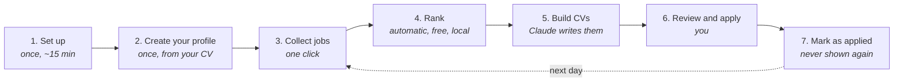

# Job Pipeline

**Finds jobs that fit you and writes a tailored CV and cover letter for each
one, on your own computer.** Works on Mac, Windows and Linux.

[](https://github.com/oommaarrr/job-application-pipeline/actions/workflows/selftest.yml)

You collect postings with one click. A free AI on your laptop reads every one
and keeps only the jobs that match you. Claude then writes a CV and a cover
letter for each match, and you review and send them.


<table>
  <tr>
    <td width="50%"></td>
    <td width="50%"></td>
  </tr>
  <tr>
    <td align="center"><b>Fit ranking</b>: every job scored, with the reason</td>
    <td align="center"><b>Applications</b>: CV, cover letter and posting for each</td>
  </tr>
</table>

<sub>Screenshots show a made-up person and made-up companies.</sub>

---

## How it works



| Step | You do | It does |
|---|---|---|
| **Collect** | press **+ Arbeitnow**, or run your saved LinkedIn, Indeed and StepStone searches from the Chrome extension | gathers postings with their full descriptions |
| **Rank** | press **Rank pool** | a local AI reads every posting and drops the ones that don't fit: wrong language, too senior, wrong field |
| **Build** | choose how many, press **Build** | Claude writes a one-page CV and a cover letter for each of the best matches |
| **Apply** | open **Applications**, download, send | |
| **Mark applied** | press **Mark this job applied** in the extension | that job never comes back |

---

## What you need

- **A Mac, Windows or Linux computer.**
- **A Claude subscription**, for writing the CVs.
- **Google Chrome** (optional), only for collecting from LinkedIn, Indeed or StepStone.

Everything else (Python on Windows, [Ollama](https://ollama.com), [Claude
Code](https://claude.com/claude-code), and Git for Windows) is installed by the
first start, which asks before each one. On a Mac or Linux you need Python 3.11+
(`python3 --version`); on Windows it is installed for you too.

---

## Set up on Mac or Linux

**1. Get the code.** Download the ZIP from this page (green **Code** button →
**Download ZIP**) and unzip it, or `git clone` it.

**2. Start it.** Open a terminal in that folder (on a Mac: right-click the
folder in Finder → **New Terminal at Folder**) and run:

```bash
./start.sh
```

The first time, it sets everything up by itself and **asks before each step**:

- installs **Ollama** (the local AI that ranks jobs) and **Claude Code** (writes
  the CVs) if they are missing
- signs you in to Claude (your browser opens)
- creates your profile from your current CV: drag the CV file (PDF, Word or
  text) into the window when it asks
- offers to start Job Pipeline by itself at every login, so it is always there

Then your browser opens the dashboard. If Ollama already has a model installed,
that one is used; otherwise the local model (a few GB, once) downloads in the
background. Every step can be skipped and is offered again next
time. **Open `profiles/me/profile.md` once and check it**: it decides which jobs
rank highly.

Keep the window open while you use it; `Ctrl+C` stops it. Next time, just run
`./start.sh` again.

**3. (Optional) Install the Chrome extension**: see [below](#chrome-extension-optional).

<details>
<summary>Doing the steps by hand instead</summary>

```bash
./setup.sh                                          # the same setup, on its own
curl -fsSL https://claude.ai/install.sh | bash     # install Claude Code
claude auth login                                   # sign in
claude "/make-profile ~/Downloads/my-cv.pdf"        # your profile, from your CV
scripts/install-agent.sh                            # start at every login (--remove undoes it)
```
</details>

---

## Set up on Windows

Windows 10 or 11. Everything runs natively; no WSL, no admin rights.

**1. Get the code.** Download the ZIP from this page (green **Code** button →
**Download ZIP**) and unzip it somewhere normal, like `Documents`.

**2. Start it:** double-click **`start.bat`** in that folder.

The first time, it sets everything up by itself and **asks before each step**:

- installs **Python** if there is none (press **Y**)
- installs **Git for Windows**, **Ollama** (the local AI that ranks jobs) and
  **Claude Code** (writes the CVs) if they are missing, and puts Claude Code on
  your PATH
- signs you in to Claude (your browser opens)
- creates your profile from your current CV: drag the CV file into the window
  when it asks
- offers to start Job Pipeline by itself at every login, in the background with
  no window, so it is always there

Then your browser opens the dashboard; Ollama starts by itself. If it already
has a model installed, that one is used; otherwise the local model (a few GB,
once) downloads in the background. Every step can be skipped
and is offered again next time. **Open `profiles\me\profile.md` once and check
it**: it decides which jobs rank highly.

Keep the window open while you use it; close it to stop. Next time, just
double-click `start.bat` again.

**3. (Optional) Install the Chrome extension**: see below.

<details>
<summary>Doing the steps by hand instead</summary>

In PowerShell, then **open a new window** so it finds what was installed:

```powershell
winget install -e --id Python.Python.3.12 --source winget
winget install -e --id Git.Git --source winget
winget install -e --id Ollama.Ollama --source winget
irm https://claude.ai/install.ps1 | iex
claude auth login
claude "/make-profile C:\Users\you\Downloads\my-cv.pdf"
```

`setup.bat` runs the same setup on its own, and `scripts\install-agent.bat`
(`--remove` to undo) starts it at every login. If `claude` is "not recognised"
after installing it, run `start.bat` again: it adds Claude Code to your PATH.
</details>

---

## Chrome extension (optional)

To collect from LinkedIn, Indeed and StepStone:

1. Open `chrome://extensions` in Chrome
2. Turn on **Developer mode** (top right)
3. Click **Load unpacked** and choose the `extension` folder inside this project
4. Click the puzzle icon in the toolbar and pin **Job Collector**

Every saved search shows which site it runs on.

---

## Everyday use

1. Run `./start.sh` (Windows: `start.bat`). The dashboard opens.
2. **Collect.** Press **+ Arbeitnow**, or in the Chrome extension open
   **Saved searches** and press **Run all searches now**.
3. **Rank.** Press **Rank pool**. It takes a few minutes; the **Funnel** shows
   how many jobs survived each filter.
4. **Build.** Pick how many applications you want (5 is a good start) and press
   **Build**. Each one uses some of your Claude usage.
5. **Apply.** Click **Applications** at the top: each job has its CV, its cover
   letter and a link to the posting.
6. **Mark it.** After applying, open the job's page, click the extension, and
   press **Mark this job applied**.

The extension's **Dashboard**, **Applications** and **Fit ranking** buttons open
these pages from anywhere.

---

## Where your files are

| What | Where |
|---|---|
| Your profile | `profiles/me/`, never uploaded anywhere |
| Your CVs and cover letters | `builder/applications/<date>/<Company>/` |
| After **Erase everything** | moved to `builder/applications/archive/`, never deleted |
| Jobs you applied to | `scraper/history/applied.csv` (date, company, title, link), kept forever |
| Jobs collected in the last 30 days | `scraper/history/seen.csv` (title and company only). A job that comes back on a later day is skipped |

**Erase everything and start fresh** (in the extension, under **More**) clears
the collected jobs so the next collection starts from zero, and moves every
built CV and letter into the archive. It never touches your applied list or the
30-day job history, so jobs you applied to, and jobs already collected on an
earlier day, still never come back.

---

## If something goes wrong

**Look at the dashboard first.** The Setup panel checks everything, and every
step that fails shows why, the fix, and a **Retry** button. Retrying is always
safe: finished work is kept and skipped. The **Activity** panel lists everything
that happened.

| Problem | Fix |
|---|---|
| The dashboard or the extension says the pipeline is offline | Double-click `start.bat` (Windows) or run `./start.sh`, and keep its window open. To never see this again, let setup start it at every login |
| "Ollama is not running" | It starts by itself when installed; if it keeps failing, open the Ollama app |
| "Your profile is filled in" is red | Run setup again and give it your CV, or `claude "/make-profile <path to your CV>"` |
| Build stops straight away | Read the message in the build log; usually the profile or the Claude login |
| The extension shows old things | You have two copies loaded. Remove the old one at `chrome://extensions` |
| Windows: Python could not be installed | Install it from python.org, tick **Add python.exe to PATH**, then double-click `start.bat` again |
| Windows: typing `python` opens the Microsoft Store | Same fix: that is Windows' placeholder, not Python |
| Windows: "Git for Windows is not installed" | Double-click `start.bat` again and answer **Y**, or `winget install -e --id Git.Git --source winget` |
| Windows: `claude` is not recognised | Double-click `start.bat` again (it adds Claude Code to PATH), then open a new window |

---

## Learn more

[**docs/GUIDE.md**](docs/GUIDE.md) covers everything in depth: every extension
feature, the job sources, how ranking decides, the settings you can change,
how Claude writes the documents, the CV-writing rules, and privacy.

## A note on job sites

LinkedIn, Indeed and StepStone don't allow automated collection in their terms.
The extension reads only search pages you open yourself, at human pace, from
your own browser. Still, know it before you use it. The Arbeitnow source is a
public API and raises none of this.

## License

MIT, see [LICENSE](LICENSE).
