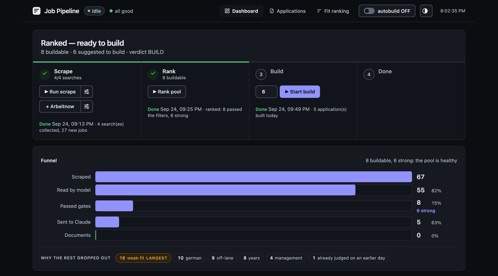
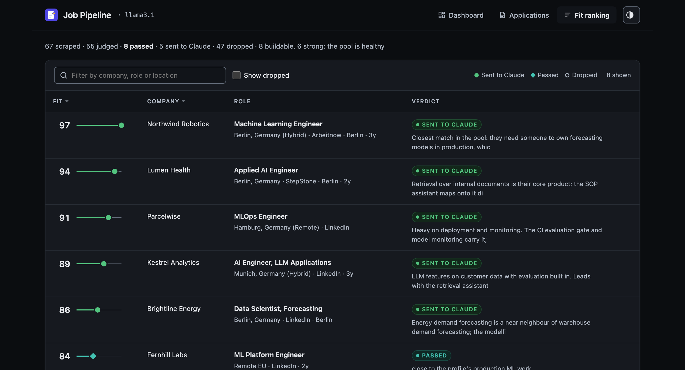
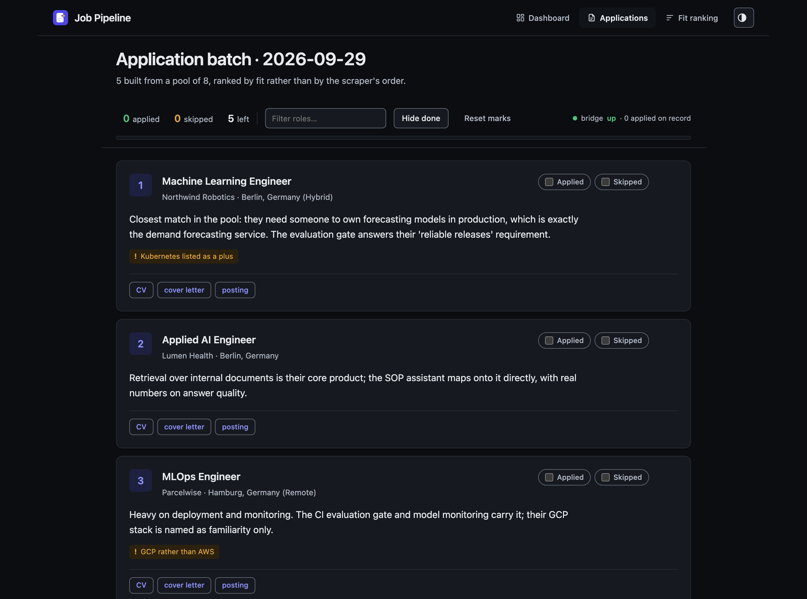
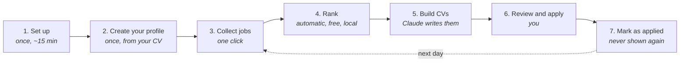
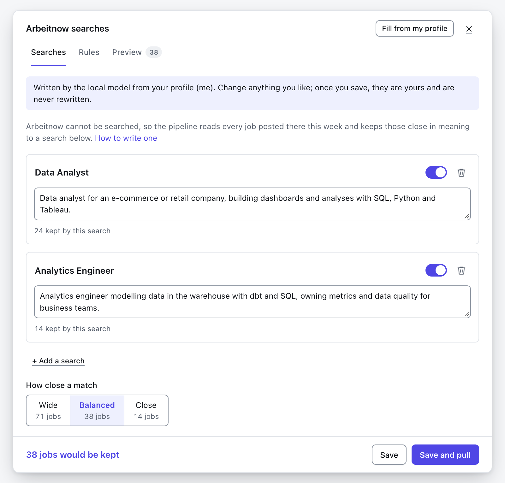
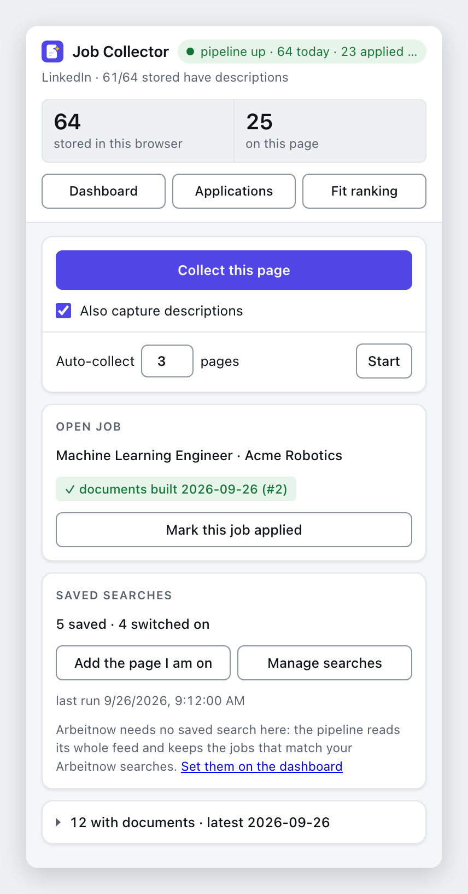
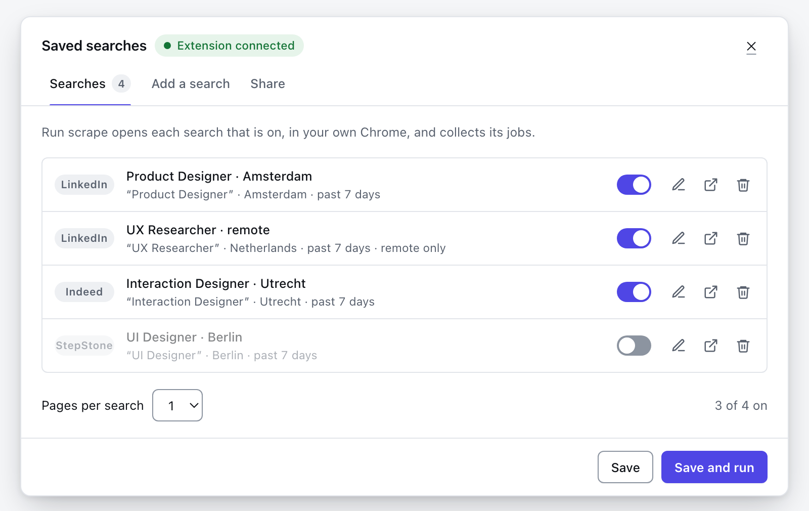

# Job Pipeline

<br clear="left">

**Finds jobs that fit you and writes a tailored CV and cover letter for each
one, on your own computer.** Works on Mac, Windows and Linux.

[](https://github.com/oommaarrr/job-application-pipeline/actions/workflows/selftest.yml)

You collect postings with one click. A free AI on your laptop reads every one
and keeps only the jobs that match you. Claude then writes a CV and a cover
letter for each match, and you review and send them.



<table>
  <tr>
    <td width="50%"></td>
    <td width="50%"></td>
  </tr>
  <tr>
    <td align="center"><b>Fit ranking</b>: every job scored, with the reason</td>
    <td align="center"><b>Applications</b>: CV, cover letter and posting for each</td>
  </tr>
</table>

<sub>Screenshots show a made-up person and made-up companies.</sub>

---

## How it works


```mermaid
flowchart LR
    A["1. Set up<br/><i>once, ~15 min</i>"] --> B["2. Create your profile<br/><i>once, from your CV</i>"]
    B --> C["3. Collect jobs<br/><i>one click</i>"]
    C --> D["4. Rank<br/><i>automatic, free, local</i>"]
    D --> E["5. Build CVs<br/><i>Claude writes them</i>"]
    E --> F["6. Review and apply<br/><i>you</i>"]
    F --> G["7. Mark as applied<br/><i>never shown again</i>"]
    G -.->|next day| C
```

| Step | You do | It does |
|---|---|---|
| **Collect** | press **+ Arbeitnow**, and **Run scrape** for your saved LinkedIn, Indeed and StepStone searches (run in Chrome by the extension) | gathers postings with their full descriptions; from Arbeitnow it keeps the jobs that match your searches by meaning |
| **Rank** | press **Rank pool** | a local AI reads every posting and drops the ones that don't fit: wrong language, too senior, wrong field |
| **Build** | choose how many, press **Build** | Claude writes a one-page CV and a cover letter for each of the best matches |
| **Apply** | open **Applications**, download, send | |
| **Mark applied** | press **Mark this job applied** in the extension | that job never comes back |

---

## What you need

- **A Mac, Windows or Linux computer.**
- **A Claude subscription**, for writing the CVs.
- **Google Chrome** , only for collecting from LinkedIn, Indeed or StepStone.

Everything else (Python on Windows, [Ollama](https://ollama.com), [Claude
Code](https://claude.com/claude-code), and Git for Windows) is installed by the
first start, which asks before each one. On a Mac or Linux you need Python 3.11+
(`python3 --version`); on Windows it is installed for you too.

---

## Set up on Mac or Linux

**1. Get the code.** Download the ZIP from this page (green **Code** button →
**Download ZIP**) and unzip it, or `git clone` it.

**2. Start it.** Open a terminal in that folder (on a Mac: right-click the
folder in Finder → **New Terminal at Folder**) and run:

```bash
./start.sh
```

The first time, it sets everything up by itself and **asks before each step**:

- installs **Ollama** (the local AI that ranks jobs) and **Claude Code** (writes
  the CVs) if they are missing
- signs you in to Claude (your browser opens)
- creates your profile from your current CV: drag the CV file (PDF, Word or
  text) into the window when it asks
- asks to start Job Pipeline by itself at every login (say **yes**)

Then your browser opens the dashboard. If Ollama already has a model installed,
that one is used; otherwise the local model (a few GB, once) downloads in the
background. Every step can be skipped and is offered again next
time. **Open `profiles/me/profile.md` once and check it**: it decides which jobs
rank highly.

**You run `./start.sh` once.** Job Pipeline is a small program on your own
computer: the dashboard is a page it serves, and the Chrome extension talks to
it. With start-at-login on, it runs in the background from then on, starts by
itself when you log in, and restarts itself if it ever crashes. Open the
dashboard from a bookmark: <http://127.0.0.1:8765/dashboard>.

If you said no, it runs only while that terminal window is open (`Ctrl+C`
stops it), and `./start.sh` asks once more next time. Turn it on later with
`scripts/install-agent.sh`, off with `scripts/install-agent.sh --remove`.

On a Mac, keep the project out of Desktop, Documents, Downloads and iCloud
Drive. macOS does not let anything started at login read those folders, so
start-at-login would never start. `./start.sh` says so instead of offering it.
Your home folder (for example `~/job-pipeline`) is fine.

**3. (Optional) Install the Chrome extension**: see [below](#chrome-extension-optional).

<details>
<summary>Doing the steps by hand instead</summary>

```bash
./setup.sh                                          # the same setup, on its own
curl -fsSL https://claude.ai/install.sh | bash     # install Claude Code
claude auth login                                   # sign in
claude "/make-profile ~/Downloads/my-cv.pdf"        # your profile, from your CV
scripts/install-agent.sh                            # start at every login (--remove undoes it)
```
</details>

---

## Set up on Windows

Windows 10 or 11. Everything runs natively; no WSL, no admin rights.

**1. Get the code.** Download the ZIP from this page (green **Code** button →
**Download ZIP**) and unzip it somewhere normal, like `Documents`.

**2. Start it:** double-click **`start.bat`** in that folder.

The first time, it sets everything up by itself and **asks before each step**:

- installs **Python** if there is none (press **Y**)
- installs **Git for Windows**, **Ollama** (the local AI that ranks jobs) and
  **Claude Code** (writes the CVs) if they are missing, and puts Claude Code on
  your PATH
- signs you in to Claude (your browser opens)
- creates your profile from your current CV: drag the CV file into the window
  when it asks
- asks to start Job Pipeline by itself at every login, in the background with
  no window (say **Y**)

Then your browser opens the dashboard; Ollama starts by itself. If it already
has a model installed, that one is used; otherwise the local model (a few GB,
once) downloads in the background. Every step can be skipped
and is offered again next time. **Open `profiles\me\profile.md` once and check
it**: it decides which jobs rank highly.

**You double-click `start.bat` once.** Job Pipeline is a small program on
your own computer: the dashboard is a page it serves, and the Chrome extension
talks to it. With start-at-login on, it runs in the background with no window
from then on, and starts by itself when you log in. Open the dashboard from a
bookmark: <http://127.0.0.1:8765/dashboard>.

If you said no, it runs only while that window is open (closing it stops it),
and `start.bat` asks once more next time. Turn it on later with
`scripts\install-agent.bat`, off with `scripts\install-agent.bat --remove`.

**3. Install the Chrome extension**: see below.

<details>
<summary>Doing the steps by hand instead</summary>

In PowerShell, then **open a new window** so it finds what was installed:

```powershell
winget install -e --id Python.Python.3.12 --source winget
winget install -e --id Git.Git --source winget
winget install -e --id Ollama.Ollama --source winget
irm https://claude.ai/install.ps1 | iex
claude auth login
claude "/make-profile C:\Users\you\Downloads\my-cv.pdf"
```

`setup.bat` runs the same setup on its own, and `scripts\install-agent.bat`
(`--remove` to undo) starts it at every login. If `claude` is "not recognised"
after installing it, run `start.bat` again: it adds Claude Code to your PATH.
</details>

---

## Arbeitnow searches

[Arbeitnow](https://www.arbeitnow.com) is the one source that needs no browser:
press **+ Arbeitnow** on the dashboard. Its feed can't be searched, so the
pipeline reads every job posted there in the last week (about 3,400) and keeps
the ones that are **close in meaning** to your searches. A "Software Engineer"
whose description is all LLM work is found by an "AI engineer" search even though
the title doesn't say so. The local model then judges each kept job against your
profile, like any other job.



**Edit them** with the settings button attached to **+ Arbeitnow** (or **Set them
on the dashboard** in the extension). The window has three tabs:

- **Searches.** One card per kind of job. Describe the work, not only the title:
  the role, what you would do, the field, the main tools. For example
  *"Designer for a B2B SaaS product, owning user research, flows and UI in
  Figma"*. Add up to 8, switch any off, and each shows how many jobs it keeps.
  Below them, **How close a match**: Wide, Balanced or Close, each with how
  many jobs it would keep this week.
- **Rules.** **On site or hybrid in:** The countries you'd work in. Leave it empty to keep
  jobs from anywhere. A job whose location names no country is always kept.
  Then switches for **fully remote jobs based in other countries** and for
  **internships, working-student jobs, theses and apprenticeships** (off by
  default), and **Posted in the last** 1, 3 or 7 days.
- **Preview.** A sample of the jobs that would be kept, and the ones just below
  the line.

Every change updates the count at the bottom of the window ("38 jobs would be
kept"); click it to see the preview. **Save and pull** saves and collects them.

**Where the first searches come from.** You don't have to write them. The first
time, the local model reads your profile and suggests the searches, the
countries, remote and internships. It works in small steps and checks each
answer: a search your profile rules out is left out, and a country only counts
if your profile names a place in it. Press **Fill from my profile** to have it
suggest again, for example after you change your profile. Once you save, the
searches are yours and are never rewritten.

It all runs on your computer. The matching uses a small model, `nomic-embed-text`
(about 270 MB), which setup installs next to the ranking model. The first pull
takes a few minutes; after that only new jobs are read, so it takes about a
minute.

---

## Chrome extension 

The extension, **Job Collector**, collects jobs from LinkedIn, Indeed and
StepStone and sends them to the pipeline. It reads only pages in your own
Chrome, where you are already signed in, at a human pace. It is optional only in
the sense that Arbeitnow works without it: **every LinkedIn, Indeed and StepStone
search runs through it**, so without it those sites are not collected at all.

Your searches are managed on the dashboard (see [Saved
searches](#saved-searches)); the extension pulls them from the pipeline about
once a minute and runs them when you press **Run scrape**.



**Install it once:**

1. Open `chrome://extensions` in Chrome
2. Turn on **Developer mode** (top right)
3. Click **Load unpacked** and choose the `extension` folder inside this project
4. Click the puzzle icon in the toolbar and pin **Job Collector**

The dashboard says whether the extension is connected: under **Scrape**, and
at the top of the **Saved searches** window.

**At the top of the popup:**

- a green dot when the pipeline is running, with how many jobs came in today,
  how many you applied to and how many were ranked (red means it is not
  running; see [If something goes wrong](#if-something-goes-wrong))
- how many jobs this browser has collected, and how many are on the page open now
- **Dashboard**, **Applications** and **Fit ranking** open those pages

**On a job search page** (LinkedIn, Indeed or StepStone):

- **Collect this page** reads every job on the results page and sends them to
  the pipeline. Keep **Also capture descriptions** ticked: the local AI ranks
  jobs by reading their descriptions.
- **Auto-collect _N_ pages** does the same for the next few pages of results by
  itself. **Stop** ends it at any time.
- **Mark this job applied**: open a job you applied to and press it. That job
  never comes back in a future batch. When a CV was already built for the job,
  it says so above the button.
- **Add the page I am on** saves the search you are looking at, with every
  filter you set on the site, to your saved searches. **Manage searches** opens
  them on the dashboard.

If the pipeline was off while you collected, the jobs are kept in the browser
and sent as soon as it is back.

<br clear="right">

## Saved searches

The searches **Run scrape** runs on LinkedIn, Indeed and StepStone. Open them
with the settings button attached to **Run scrape** on the dashboard.



The badge beside the title says whether the Chrome extension is connected. The
window has three tabs:

- **Searches.** Each one shows its site and, in words, what it looks for. The
  switch turns it off without deleting it; the pencil renames it or edits its
  link; the arrow opens it on the site; the bin removes it. **Pages per search**
  sets how many pages of results each one collects.
- **Add a search.** **From keywords**: type the job title and the place, pick
  the site, how recent, the distance and remote only, and the link is built for
  you (each site spells these differently; on Indeed, pick the country's Indeed
  site). **Preview on the site** lets you check the results first. **Paste an
  address**: set a search up on the site with every filter you want and paste
  its address. The extension's **Add the page I am on** does the same in one
  click.
- **Share.** **Copy the list** / **Replace from a copied list**: hand a good set
  of searches to someone, or move them to another computer.

Press **Save**, or **Save and run** to start a scrape straight away. Chrome
picks the run up within a minute and opens each search that is on in a
background tab, one after the other (LinkedIn in front, because it only loads
its list on screen). Keep Chrome open while it runs.

While it runs, **Run scrape** turns into **Stop scrape**: Chrome closes the
search tab within a few seconds, and the jobs already collected are kept. If a
run is stopped or cut off (Chrome closed, the laptop slept), **Run scrape**
continues with the searches it had not finished, for six hours. The pipeline
keeps that place itself, so it holds even after the extension is reloaded.

On LinkedIn a place is pinned by an internal id, not the words you type.
Whenever a LinkedIn search is open, the extension tells the pipeline which id
your place has, and the builder uses it from then on. Until then the builder
says so; opening the search once with **Preview on the site** is enough.

A new install starts with three example searches, one per site. Edit or remove
them freely.

---

## Everyday use

1. Open the dashboard: <http://127.0.0.1:8765/dashboard>. With start-at-login
   on it is always there; otherwise run `./start.sh` (Windows: `start.bat`) first.
2. **Collect.** Press **+ Arbeitnow** (its searches: [Arbeitnow
   searches](#arbeitnow-searches)), and **Run scrape** for your LinkedIn,
   Indeed and StepStone searches (they need the Chrome extension; edit them
   under [Saved searches](#saved-searches)).
3. **Rank.** Press **Rank pool**. It takes a few minutes; the **Funnel** shows
   how many jobs survived each filter.
4. **Build.** Pick how many applications you want (5 is a good start) and press
   **Build**. Each one uses some of your Claude usage.
5. **Apply.** Click **Applications** at the top: each job has its CV, its cover
   letter and a link to the posting.
6. **Mark it.** After applying, open the job's page, click the extension, and
   press **Mark this job applied**.

The extension's **Dashboard**, **Applications** and **Fit ranking** buttons open
these pages from anywhere.

---

## Where your files are

| What | Where |
|---|---|
| Your profile | `profiles/me/`, never uploaded anywhere |
| Your CVs and cover letters | `builder/applications/<date>/<Company>/` |
| After **Erase everything** | moved to `builder/applications/archive/`, never deleted |
| Jobs you applied to | `scraper/history/applied.csv` (date, company, title, link), kept forever |
| Jobs collected in the last 30 days | `scraper/history/seen.csv` (title, company, and the day the local AI judged it). A job it already judged on an earlier day is skipped |

**Erase everything and start fresh** (on the dashboard, under **Start over**)
clears the collected jobs, in the pipeline and in the extension's copy, so the
next collection starts from zero, and moves every built CV and letter into the
archive. It never touches your applied list or the
30-day job history, so jobs you applied to, and jobs the local AI already judged
on an earlier day, still never come back. The dashboard then starts a new round:
each step shows only what has happened since the erase, and until a step runs
again its card says so and shows its last result, dated, as "before the erase".

---

## If something goes wrong

**Look at the dashboard first.** The Setup panel checks everything, and every
step that fails shows why, the fix, and a **Retry** button. Retrying is always
safe: finished work is kept and skipped. The **Activity** panel lists everything
that happened.

| Problem | Fix |
|---|---|
| The dashboard or the extension says the pipeline is offline | It is not running. Double-click `start.bat` (Windows) or run `./start.sh` and answer **yes** to start-at-login; it then runs in the background for good. Already on? Its log is `scraper/out/bridge.log` |
| "Ollama is not running" | It starts by itself when installed; if it keeps failing, open the Ollama app |
| "Your profile is filled in" is red | Run setup again and give it your CV, or `claude "/make-profile <path to your CV>"` |
| Build stops straight away | Read the message in the build log; usually the profile or the Claude login |
| The extension shows old things | You have two copies loaded. Remove the old one at `chrome://extensions` |
| Windows: Python could not be installed | Install it from python.org, tick **Add python.exe to PATH**, then double-click `start.bat` again |
| Windows: typing `python` opens the Microsoft Store | Same fix: that is Windows' placeholder, not Python |
| Windows: "Git for Windows is not installed" | Double-click `start.bat` again and answer **Y**, or `winget install -e --id Git.Git --source winget` |
| Windows: `claude` is not recognised | Double-click `start.bat` again (it adds Claude Code to PATH), then open a new window |

---

## Learn more

[**docs/GUIDE.md**](docs/GUIDE.md) covers everything in depth: every extension
feature, the job sources, how ranking decides, the settings you can change,
how Claude writes the documents, the CV-writing rules, and privacy.

## A note on job sites

LinkedIn, Indeed and StepStone don't allow automated collection in their terms.
The extension reads only search pages you open yourself, at human pace, from
your own browser. Still, know it before you use it. The Arbeitnow source is a
public API and raises none of this.

## License

MIT, see [LICENSE](LICENSE).
