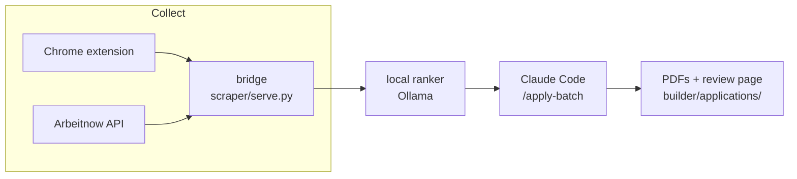

# Job Pipeline: the full guide

The [README](../README.md) gets you running. This is everything else.

- [How the pieces fit](#how-the-pieces-fit)
- [Your profile](#your-profile)
- [The Chrome extension](#the-chrome-extension)
- [Job sources](#job-sources)
- [How ranking decides](#how-ranking-decides)
- [Settings you can change](#settings-you-can-change)
- [How Claude writes the documents](#how-claude-writes-the-documents)
- [The CV-writing rules](#the-cv-writing-rules)
- [The three pages](#the-three-pages)
- [Troubleshooting](#troubleshooting)
- [Privacy and safety](#privacy-and-safety)
- [Contributing](#contributing)

---

## How the pieces fit



| Folder | What lives there |
|---|---|
| `scraper/` | the **bridge** (`serve.py`, the local server everything talks to), the ranker, the job sources |
| `builder/` | turns ranked jobs into PDFs with Claude Code |
| `extension/` | the Chrome extension, the only part that touches a job board |
| `web/` | the dashboard, fit ranking and applications pages |
| `profiles/` | you. `profiles/example` is a fictional person; yours is `profiles/me` |
| `scripts/` | `scrub.py` (blocks personal data from commits), `contrast.py` (checks colours) |

The split is deliberate. **Reading is local and free; writing is what you pay
for.** Having Claude read and rank a whole scrape once used up an entire usage
window without producing a single document. So a small model on your laptop
reads everything, and Claude only writes.

---

## Your profile

| File | Holds |
|---|---|
| `profile.md` | what you want and what you have done, briefly. **The ranker judges every job against this.** |
| `identity.md` | the name and contact line that go on your CV, your languages, your employment history and education exactly as they should appear, and anything private (work authorisation, salary expectation) that is never printed |
| `reference/PROJECTS.md` | every project: what it proves, with real numbers |
| `reference/projects/` | long write-ups Claude reads when a job leans on that project |
| `writing-rules.md` | optional: your own standing rules for Claude ("always call project X by this name", "never list Y"). Where it disagrees with the general CV skill, it wins |

The fastest way to create them is `claude "/make-profile path/to/cv.pdf"` in the
project folder. Anything your CV does not say is marked `TODO:` rather than
guessed.

**Which profile is used:** `$PROFILE_DIR` if set, otherwise `profiles/me`,
otherwise the fictional example. The ranker, the dashboard and the build all
follow this one rule (`scraper/profile_dir.py`), and the Setup panel shows which
is active. To keep two profiles:

```bash
PROFILE_DIR=profiles/other ./start.sh
```

A build **refuses to start** while your profile is still the example, so Claude
is never paid to write CVs for someone who does not exist.

---

## The Chrome extension

**Why an extension:** job boards block automated requests. A request that gets
refused from a script succeeds when the page you already have open makes it,
with your real login. The extension only reads pages you can see, at human pace.

Click the toolbar icon. The top row has **Dashboard**, **Applications** and
**Fit ranking**, which open those pages from anywhere. Below that are three tabs.

### This page

- **Collect this page** reads every job card on the search results you are
  viewing and sends it to the pipeline. Keep **Also capture descriptions** on:
  the ranker cannot judge a job without its text.
- **Auto-collect N pages** walks through the result pages by itself. It stops the
  moment you scroll or type, so you can take the tab back any time.
- **Mark this job applied**: press it on a job's page after applying. That job
  never comes back in a batch.

Each site is read its own way:

- **LinkedIn** shows 25 jobs per page and removes cards as you scroll past
  them. The collector scrolls, gathers as it goes, and waits for all 25 before
  reading. A page that yields fewer is flagged on the dashboard.
- **Indeed** and **StepStone**: the collector reads the job cards on the
  results page, then fetches each job's full description from that page, a few
  seconds apart, instead of clicking through every job.

### Saved searches

Your list of searches, each with **edit** (change its name or URL), **on / off**
(skip it without deleting) and **remove**.

- **Run all searches now** opens each search in a background tab, collects it and
  closes it. An interrupted run picks up where it stopped. Editing the list
  resets that resume point, so an edit is never ignored.
- **Export** copies the whole list to your clipboard as text; **Import** replaces
  the list from pasted text. This is how you share a good set of searches.
- **Build a search URL** makes a search for LinkedIn, Indeed or StepStone from a
  keyword, a location, a radius, a date range and a remote-only switch. Each site
  spells these differently; this does it for you.

**Locations on LinkedIn:** LinkedIn pins a search to a place with an internal id,
not the words you type, and falls back to your profile's country when the words
are ambiguous. Open a place once on LinkedIn and the popup remembers its id.

Three example searches are added on first install, one each for LinkedIn,
Indeed and StepStone. Edit or delete them freely; a search you delete does not
come back.

### More

**Erase everything and start fresh** clears every collected job, here and in the
pipeline, so the next collection returns everything again, and moves **every
built CV and cover letter** from `builder/applications/` into
`builder/applications/archive/`. Nothing is deleted. Your applied list and saved
searches are not touched, and jobs you already built still never come back.

> **Two copies of the extension?** Chrome identifies an unpacked extension by its
> folder. Loading this project's `extension` folder next to an older copy gives
> you two extensions with separate saved searches. Remove the old one.

---

## Job sources

| Source | Needs | Notes |
|---|---|---|
| **Arbeitnow** | nothing | free public API, full descriptions, Germany-focused. The **+ Arbeitnow** button. |
| **LinkedIn** | Chrome + login | the richest source |
| **Indeed** | Chrome + login | sometimes challenges automated reading; fine at human pace |
| **StepStone** | Chrome | German market |

**Adding a source:** `scraper/arbeitnow.py` is the template, about 150 lines
with comments. Fetch postings, turn each into `{title, company, location, url,
source, query, description}`, and send them to the bridge's `/ingest`. The bridge
removes duplicates, keeps the better description, and re-ranks. The dashboard
shows the new source automatically.

---

## How ranking decides

The rule is **the model reads, the code decides.** The local model pulls facts
out of each posting: the language level it requires, the years it asks for, what
the work actually is, whether it is a management job. Plain code then applies
the filters. The model is never trusted with the yes or no, because it gets
those wrong in ways that cost real applications: it reads "fluent German" as
intermediate, and "2 to 5 years" as 5 when the lower number is what matters.

**Before anything is read, two checks skip work entirely:**

- **Already applied or built**: matched on company and title, not the link, so
  the same job reposted on another board is still caught. The list is
  `scraper/history/applied.csv`, kept forever.
- **Collected on an earlier day**: `scraper/history/seen.csv` remembers the
  title and company of every job collected in the last `SEEN_DAYS` days (30).
  A job that shows up again on a later day already had its chance, so it is
  dropped and listed on the Fit ranking page as "seen earlier". The same job
  twice on one day is not a repeat. Rows older than 30 days are removed
  automatically. Set `SEEN_DAYS = 0` in `scraper/config_local.py` to turn this
  off.

Both files survive **Erase everything**, and both are plain CSV you can open in
any spreadsheet.

Filters, in order: required language, years of experience, management role,
wrong field, weak fit. **A dropped job is never deleted.** Every one is on the
Fit ranking page with its reason (tick **Show dropped**), so you can see if a
filter is too strict.

The **Funnel** on the dashboard shows how many jobs survived each step. When you
get fewer applications than you hoped, it tells you why, usually the language
filter rather than the collection.

---

## Settings you can change

Everything tunable is in `scraper/config.py`, each value commented with why it
is set the way it is. The ones you are most likely to touch:

| Setting | Does |
|---|---|
| `BUILD_TARGET` / `BUILD_TARGET_MAX` | applications per build (default 5), rising up to the max when many jobs score strongly |
| `DROP_YEARS_AT` / `DROP_YEARS_AT_REMOTE` | the years of experience that rules a job out, in Germany and elsewhere |
| `GERMAN_CAP`, `DROP_GERMAN_AT` | the German level you can work in, and where a requirement rules a job out |
| `STRONG_SCORE` | the score that counts as a strong match |
| `OLLAMA_MODEL` | any model from `ollama list`; bigger reads better, slower |

The defaults suit English-speaking technical roles in Germany. The German
language filter is the one to change first if you are elsewhere.

**Autobuild** (the switch at the top of the dashboard) builds automatically when
a scrape finishes. It is **off by default**, because it spends Claude usage
without a click. Turn it on once you trust the ranking.

**Your own settings** go in two gitignored files, so updating the code never
overwrites them: `scraper/config_local.py` (any value from `config.py`, e.g.
`BUILD_TARGET = 15`) and `local.env` (e.g. `AUTOBUILD=1`).

**Start at login (Mac):** `scripts/install-agent.sh` runs the bridge in the
background at every login and restarts it if it crashes.
`scripts/install-agent.sh --remove` undoes it.

**When something fails:** every step writes what happened to
`scraper/out/events.jsonl`, shown on the dashboard's Activity panel. A failed
step shows its reason, a fix and a Retry button. Every step is safe to re-run:
collection skips searches already done, ranking reuses its cache, and a build
skips every application already on disk and finishes a half-written review page
from what is there.

**Two copies at once:** `BRIDGE_PORT=8799 ./start.sh` runs a second copy on
another port. Everything the bridge starts follows it, except the Chrome
extension, which always talks to port 8765.

---

## How Claude writes the documents

Pressing **Build** runs `builder/run-batch.sh`, which:

1. ranks the pool locally,
2. checks your profile is filled in (and stops if it is not),
3. links your profile at `builder/profile`,
4. starts Claude Code in the background: `claude -p "/apply-batch N"`.

Claude then follows `builder/.claude/commands/apply-batch.md`: read each job's
full description, drop any the ranker misjudged, write a CV and a letter as data,
check them, and render them to PDF with `build_docs.py`. It writes a `batch.json`
with its reasoning, which becomes the Applications page.

If Claude stops on purpose (profile not filled in, nothing worth building), it
says why and the run ends, without retrying and spending more.

**The skill must live in the project.** A Claude skill saved to your account
works in an interactive session but is missing from background runs, so the
build would write without its rules. It lives at
`builder/.claude/skills/cv-builder/` for that reason.

Output: `builder/applications/<date>/<Company>/` holds the CV, the letter, and the
data they were built from. The Applications page is re-rendered from that data
every time you open it, so it always uses the current design.

---

## The CV-writing rules

`builder/.claude/skills/cv-builder/SKILL.md` is the rulebook Claude writes by,
distilled from building a few hundred real applications. The short version:

- **One page, filled.** A half-empty page reads as a thin candidate. The builder
  refuses a single-page CV under 90% full; the fix is more real content, never
  bigger spacing.
- **Named projects, spread out.** Every bullet opens with the project's name in
  bold. At least four different projects, at most two bullets each.
- **Outcomes over mechanisms.** Every bullet must be something you could explain
  out loud in an interview without notes.
- **A summary that doesn't sound generated.** Two or three sentences, leading
  with a fact. No "passionate", "proven track record" or "results-driven".
- **Tailored every time.** The headline mirrors the job title, the posting's own
  keywords appear, and no two CVs in a batch read alike.
- **Never concede, never invent.** No weakness is ever stated on a CV or letter;
  honest caveats go in Claude's notes to you. And nothing is written that is not
  in your profile.

The skill has the full structure, the data format, the cover letter's four
paragraphs, and a checklist.

---

## The three pages

| Page | What it shows |
|---|---|
| **Dashboard** | setup checklist, the collect / rank / build steps, the funnel, per-source health, the live build |
| **Fit ranking** | every job the model read: score, verdict and reason. Filter, sort, show dropped. |
| **Applications** | one card per application: CV, letter, posting link, and applied / skipped marks |

They live in `web/` as plain HTML, CSS and JavaScript: no build step, no
framework, nothing loaded from the internet. `web/tokens.css` is the only place
colours, type and spacing are defined. Light, dark or follow-your-system is the
button at the top right.

---

## Troubleshooting

**A search collected 7 jobs instead of 25.** The tab was in the background or you
scrolled during the run. Keep it in front and hands off.

**Ranking takes a long time.** Normal: a local model reading 200 descriptions
takes 15 to 30 minutes. Answers are cached, so ranking again after a settings
change is quick.

**Claude built fewer than I asked.** Open the build log from the dashboard.
Usually a job was already applied to, or its description was too thin to tailor.
If Claude is rejecting most of a batch, the ranking filters need adjusting, not
the build.

**Everything shows zero after midnight.** The job pool is per day. Yesterday's
jobs are archived, not lost.

**Build refuses with "qpdf".** It no longer should; `qpdf` is optional. For
smaller PDFs, `brew install qpdf`.

---

## Privacy and safety

Everything runs on your computer. The bridge only listens on your own machine
(`127.0.0.1`). The local model never sends anything anywhere. The only outside
traffic is the job boards you browse, the Arbeitnow API, and Claude when you
build.

`profiles/*` (except the fictional example) is never committed: it is in
`.gitignore`. `scripts/scrub.py` refuses any commit containing an email, a phone
number, a street address or a CV PDF. Turn it on once:

```bash
ln -sf ../../scripts/scrub.py .git/hooks/pre-commit
```

It checks patterns, not meaning. It cannot recognise a name or a private fact, so
read what you commit.

---

## Contributing

- **Publishing a copy**: if you use the pipeline yourself and also share it,
  `scripts/export-open-source.sh` copies only what git would commit (never
  your profile, settings, history or CVs) into `../job-pipeline-open-source`,
  then runs the privacy scan on the copy.
- **Add a source**: copy `scraper/arbeitnow.py`, see [Job sources](#job-sources).
- **Change a filter**: the rules are in `scraper/rank_ollama.py`; the gate tests
  in `scraper/test_gate.py` must still pass (`./scraper/.venv/bin/python
  scraper/test_gate.py`).
- **Change the look**: edit `web/tokens.css`, then check contrast with
  `python3 scripts/contrast.py web/tokens.css`.
- Most rules in the code carry a comment saying what went wrong without them.
  Read it before changing the rule.
